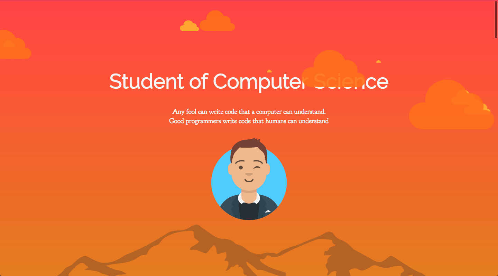

 
---
## Intro    
This is my personal website mainly for showcasing my projects and other information. 
You can see the live demo on [Simons Resume Website](https://edsimon.github.io/resume_website/)

---
#### Purpose 
This is my side project i scrambled together to first of all have a website that i can specialise to my needs and to
learn the noble craft of web development. I have done a website using pure html/css/js but i wanted to learn some of the 
more modern types of coding. So i started the project with [React](https://reactjs.org/). Learned a lot about how 
everything goes together to finally start my own project. 

---
#### How i did it
So to start simple, React is a framework to javascript where you can create components, these components are built up
with JSX which is classes or functions that return some HTML code in return. This makes it possible to create your own 
HTML tag. The two main feature of coding like this is code reusability and code that is easy to read and navigate. 

First of i have the function index.js that is the main component. It pretty much only calls the App.js function.
This App.js contain the blueprint of the website, here you can easily read each component and its place on the website.

---
#### Things to work with
There is still a loot of things to do before this project is fully finished.
 
- [X] Get a lot of information uploaded
- [ ] Create a better about me component
- [ ] Make components more readable
- [ ] Use sass or less instead of css
- [ ] Get a good score on google Audit test
- [ ] Update the project page
- [ ] Make some small animations
- [ ] Understand service worker
- [ ] Take a new photo of me

--- 
####Libraries used
* React
* Spring
* Router
* Reveal
* Stack Grid
* d3 

